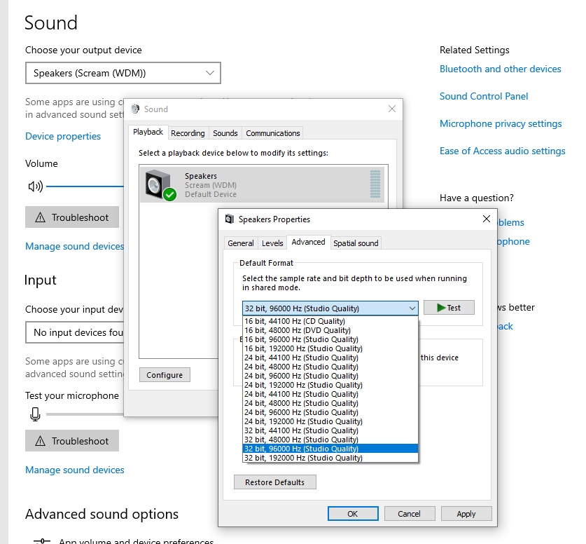

Scream - Virtual network sound card for Microsoft Windows
---------------------------------------------------------------
Scream is a virtual device driver for Windows that provides a
discrete sound device. Audio played through this device is
published on your local network as a PCM multicast stream.

Receivers on the network can pick up the stream and play it
through their own audio outputs. Two simple receivers for Linux
(interfacing with PulseAudio or ALSA) and one for Windows are
provided.

Scream is based on Microsoft's MSVAD audio driver sample code.
The original code is licensed under MS-PL, as are my changes
and additions. See LICENSE for the actual license text.

Download and install
---------------------------------------------------------------
A ZIP file containing a signed x64 build is [available on the
GitHub releases page](https://github.com/duncanthrax/scream/releases).
The "installer" is a batch file that needs to be run with
administrator rights.

The build is supposed to run on all x64 versions of Windows 7
through Windows 10. 

Microsoft has [recently tightened the rules for signing kernel
drivers](https://docs.microsoft.com/en-us/windows-hardware/drivers/install/kernel-mode-code-signing-policy--windows-vista-and-later-). These new rules apply to newer Windows 10 installations
that were not upgraded from an earlier version. If your installation
is subject to these rules, the driver will not install.
**Workaround: [Disable secure boot in BIOS](https://docs.microsoft.com/en-us/windows-hardware/manufacture/desktop/disabling-secure-boot).**
For more information, see [this issue](https://github.com/duncanthrax/scream/issues/8).

Receivers
---------------------------------------------------------------
- Linux/Pulseaudio: Not included in the installer package. Just
type 'make' to build it. You might need to install build tools
and Pulseaudio development packages.

- Linux/ALSA: Contributed by @ivan. Not included in the installer
package. Just type 'make' to build it.You might need to install
build tools and ALSA development packages.

- Windows: ScreamReader, contributed by @MrShoenel. Included in
the installer package as of version 1.2.

All three receivers can be run as unprivileged users. Receiver
systems that have an input firewall need to open UDP port 4010,
or whatever custom port you use.

Functional description
---------------------------------------------------------------
All audio played through the Scream device will be put onto
the local LAN as a multicast stream (using unicast is optional -
see below). Delay is minimal, since all processing is done
on kernel level. There is no userspace portion.

The multicast target address and port is
"239.255.77.77:4010". The audio is a raw PCM, always with two
channels (stereo). The the default sampling rate and size can be set
as the "Default format" in the driver "Advanced" property page.
Data is transferred in UDP frames with a payload size of max.
1154 bytes, consisting of 2 bytes header and 1152 bytes PCM data.
The latter number is divisible by 4, 6 and 8, so a full number
of samples for both channels will always fit into a packet.
The first header byte denotes the sampling rate. Bit 7 specifies
the base rate: 0 for 48kHz, 1 for 44,1kHz. Other bits specify the
multiplier for the base rate. The second header byte denotes the
sampling width, in bits. No magic necessary there.

Receivers simply need to read the stream off the network and
stuff it into a local audio sink. The receiver system's kernel
should automatically do the necessary IGMP signalling, so it's
usually sufficient to just open a multicast listen socket and
start reading from it. Minimal buffering (~ 4 times the UDP
payload size) should be done to account for jitter. 

Setting the sampling rate
-------------------------------------------------------------
To satisfy your audiophile feelings, or to reduce unnecessary
resampling, you might want to set a higher sampling rate and/or
sampling width. You can do that on the driver "Advanced" property
page:

Using unicast
-------------------------------------------------------------
Tweak the registry in the manner depicted in this screenshot
(you will have to create the "Options" key), then reboot:

Building
-------------------------------------------------------------
Visual Studio and a recent WDK are required. Good luck!
