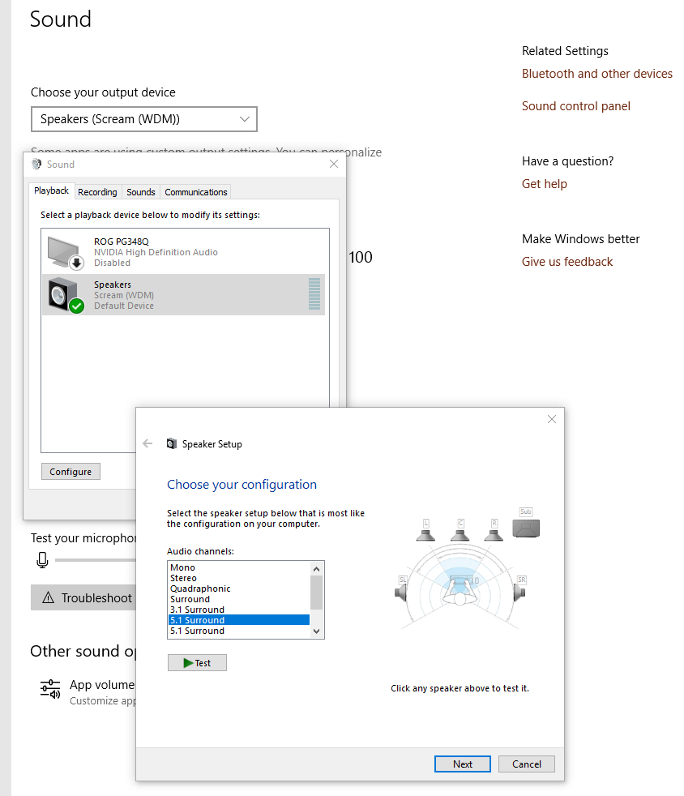
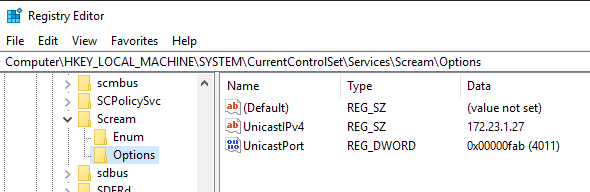
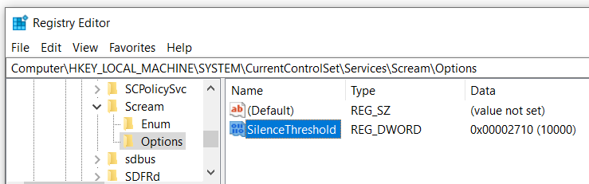

Scream - Virtual network sound card for Microsoft Windows
---------------------------------------------------------------
Scream is a virtual device driver for Windows that provides a
discrete sound device. Audio played through this device is
published on your local network as a PCM multicast stream.

Receivers on the network can pick up the stream and play it
through their own audio outputs. Receivers are available for
Unix/Linux (interfacing with PulseAudio or ALSA) and for Windows.

For the special scenario of a Windows guest on a QEMU host,
@martinellimarco has contributed support for transferring audio
via the IVSHMEM driver mechanism, similar to the GPU
pass-through software "Looking Glass". See the section on
IVSHMEM below.

Scream is based on Microsoft's MSVAD audio driver sample code.
The original code is licensed under MS-PL, as are my changes
and additions. See LICENSE for the actual license text.

Download and install
---------------------------------------------------------------
A ZIP file containing signed builds for Windows 10 on x64, x86
and arm64 is [available on the GitHub releases page](https://github.com/duncanthrax/scream/releases).
The "installer" is a batch file that needs to be run with
administrator rights.

#### Installation on Windows 10 version 1607 and newer

Microsoft has [recently tightened the rules for signing kernel
drivers](https://docs.microsoft.com/en-us/windows-hardware/drivers/install/kernel-mode-code-signing-policy--windows-vista-and-later-). These new rules apply to newer Windows 10 installations
which were not upgraded from an earlier version. If your installation
is subject to these rules, the driver will not install.

However, cross-signed kernel drivers are still accepted by Windows 10 version 1607 (and greater) if any of the following exceptions apply:

- The driver is a boot-up driver
- Windows 10 was upgraded from a version preceding 1607
- Secure Boot is disabled in BIOS or not available at all
- The driver was signed with a certificate issued before 29 July 2015
- A special registry value has been set, thereby allowing cross-signed drivers to load on systems with Secure Boot enabled

**Workaround #1: [Disable secure boot in BIOS](https://docs.microsoft.com/en-us/windows-hardware/manufacture/desktop/disabling-secure-boot).**
For more information, see [this issue](https://github.com/duncanthrax/scream/issues/8).

**Workaround #2: Add this special registry value:**

```
[HKEY_LOCAL_MACHINE\SYSTEM\CurrentControlSet\Control\CI\Policy]
"UpgradedSystem"=dword:00000001
```

Please review the following resources for more information.

- ["Back Doors for Cross-Signed Drivers", a blogpost by Geoff Chappell](https://www.geoffchappell.com/notes/security/whqlsettings/index.htm)
- ["Windows 10 Anniversary Update - Digital Signature Question", a forum thread on MyDigitalLife](https://forums.mydigitallife.net/threads/windows-10-anniversary-update-digital-signature-question.69970/#post-1272392)

#### Installation on Windows 11

The installation methods above will not work on Windows 11, as the installation batch file relies on `devcon-x64`, which is not compatible with Windows 11. You can install unsigned drivers for Windows 11 with an alternative method, leveraging devcon's successor, `pnputil` and `bcdedit` to put Windows 11 in Test Mode. To install Scream for Windows 11:

1. Ensure that Secure Boot is not enabled.
2. Enable Test Mode: Open an administrator command prompt, and issue `bcdedit /set testsigning on`. Reboot your machine, and ensure you see "Test Mode" on the bottom-right corner of your wallpaper.
3. Install the driver: Open an administrator command prompt, and navigate your terminal to `<scream folder>/Install/driver/<architecture>/`. Then, issue: `pnputil /add-driver .\Scream.inf /install`.
4. Turn Off Test Signing: From an administrator command prompt, issue `bcdedit /set testsigning off`. Then, restart your computer. Ensure that Test Mode is now disabled by ensuring there is no message of "Test Mode" present on the bottom-right corner of your wallpaper. You should now see the Scream audio device in your audio devices, and can proceed with client setup.

Receivers
---------------------------------------------------------------
- Unix with Pulseaudio, JACK or ALSA: Not included in the installer package.
Please see [the README in the Receivers/unix folder](https://github.com/duncanthrax/scream/tree/master/Receivers/unix).
Various contributors have written code for this receiver:
    * @roovio: JACK support.
    * @ivan: Original ALSA code.
    * @martinellimarco: IVSHMEM support.
    * @accumulator: Refactoring into single binary and cmake support.
    * @F5OEO: Raw output support.

- Windows: ScreamReader, contributed by @MrShoenel. Included in
the installer package as of version 1.2. This receiver does not
support positional mapping of multichannel (more than stereo)
setups - meaning a mismatch in speaker setup can lead to channels
being played in the wrong position.

- A 3rd-party receiver that supports Scream streams is
https://github.com/mincequi/cornrow. It's primarily meant for
embedded devices.

- @tomek-o wrote receivers for low-power embedded systems, great
  for building ethernet-attached active speakers.
  - [STM32F429 (ARM) Scream Receiver](http://tomeko.net/projects/scream_eth/)
  - [ESP32 Scream (and RTP) Receiver](http://tomeko.net/projects/esp32_rtp_pager/)

Receivers can usually be run as unprivileged users. Receiver
systems that have an input **firewall need to open UDP port 4010**,
or whatever custom port you use.


Functional description
---------------------------------------------------------------
All audio played through the Scream device will be put onto
the local LAN as a multicast stream (using unicast is optional -
see below). Delay is minimal, since all processing is done
on kernel level. There is no userspace portion.

The multicast target address and port is "239.255.77.77:4010".
The audio is a raw PCM stream. The default sampling rate and
size can be set as the "Default format" in the driver "Advanced"
property page. The default speaker/channel configuration can be
set on the "Configure" dialog of the Scream sound device.

Data is transferred in UDP frames with a payload size of max.
1157 bytes, consisting of 5 bytes header and 1152 bytes PCM data.
The latter number is divisible by 4, 6 and 8, so a full number
of samples for all channels will always fit into a packet.
The first header byte denotes the sampling rate. Bit 7 specifies
the base rate: 0 for 48kHz, 1 for 44,1kHz. Other bits specify the
multiplier for the base rate. The second header byte denotes the
sampling width, in bits. The third header byte denotes the number
of channels being transferred. The fourth and fifth header bytes
make up the DWORD dwChannelMask from Microsofts WAVEFORMATEXTENSIBLE
structure, describing the mapping of channels to speaker positions.

Receivers simply need to read the stream off the network and
stuff it into a local audio sink. The receiver system's kernel
should automatically do the necessary IGMP signalling, so it's
usually sufficient to just open a multicast listen socket and
start reading from it. Minimal buffering (~ 4 times the UDP
payload size) should be done to account for jitter.

Setting the sampling rate (optional)
-------------------------------------------------------------
To satisfy your audiophile feelings, or to reduce unnecessary
resampling, you might want to set a higher sampling rate and/or
sampling width. You can do that on the driver "Advanced" property
page, as shown below. *Warning:* using high sampling freqs with 24/32
bits width in combination with multichannel can lead to high bit rates
on the network. We recommend to stick to 48kHz/16 bits for 5.1 or
higher channel modes, or 44.1kHz/16 if you are going to listen to
music from CDs.

 width="700"/>

Setting up default speaker configuration (optional)
-------------------------------------------------------------
Thanks to the great work of @martinellimarco, if your target
system has a multichannel speaker setup, you can extend that to
Windows as well. Use the "Configure" wizard of the sound device
driver dialog, as shown below. Please note that this is just a
system default, and that application software (like games) may
require their own settings to be made.



Using unicast instead of multicast (optional)
-------------------------------------------------------------
This is only recommended if multicast gives you problems.
Tweak the registry in the manner depicted in this screenshot
(you will have to create the "Options" key), then reboot:



Using silence suppression (optional)
-------------------------------------------------------------
Silence suppression will avoid sending data over the network
if there is silence. Once a set number of consecutive silent
samples are processed, Scream will stop sending data. Add the
following registry key - the suggested value is 10000 samples
 (~1/4 second at 44100Hz).

Tweak the registry in the manner depicted in this screenshot
(you will have to create the "Options" key), then reboot:



Using IVSHMEM between Windows guest and Linux host
-------------------------------------------------------------
> :warning: _**Note:** While this setup is possible, it is generally
> only advised if you can't use network transfer via a standard virtio-net device.
> Scream on QEMU does not benefit from using IVSHMEM. It increases CPU
> load and latency due to the polling nature of the implementation._

This can be used as an alternative to the default networked
transfer when using QEMU/KVM.
- Add a IVSHMEM device to your VM. We recommend a size of 2MB.
If you use other IVSHMEM devices, we recommend to use the same
domain and bus, just varying the slot numbers. Here is a config
example:
```
...
<device>
...
 <shmem name='scream-ivshmem'>
   <model type='ivshmem-plain'/>
   <size unit='M'>2</size>
   <address type='pci' domain='0x0000' bus='0x00' slot='0x11' function='0x0'/>
 </shmem>
 ...
</device>
...
```
Alternatively, for those who don't use libvirt, here is an example for the relevant parts of a QEMU command line:
```
...
-device ivshmem-plain,memdev=ivshmem_scream \
-object memory-backend-file,id=ivshmem_scream,share=on,mem-path=/dev/shm/scream-ivshmem,size=2M \
...
```
- Install the IVSHMEM driver from [here](https://fedorapeople.org/groups/virt/virtio-win/direct-downloads/upstream-virtio/). As is Windows will automatically install a dummy driver for the IVSHMEM device. To use the IVSHMEM device the `PCI standard RAM Controller` in the `System Devices` node must be manually updated with the one downloaded above.
- To make the driver use IVSHMEM, add a DWORD `HKLM\SYSTEM\CurrentControlSet\Services\Scream\Options\UseIVSHMEM`,
with the value being the size of the device in MB (2, as recommended). Please
note that scream will identify the device by its size, so you should only
have one IVSHMEM device with that specific size. Also note that you
might have to create the `Options` key. You can also paste this command into an
admin CMD shell to create both key and DWORD: `REG ADD HKLM\SYSTEM\CurrentControlSet\Services\Scream\Options /v UseIVSHMEM /t REG_DWORD /d 2`
- When the VM is running, check if the device exists as /dev/shm/scream-ivshmem,
and if the user you want to run the receiver as has read access.
If so, run a IVSHMEM-capable receiver with the path of the SHM file
as commandline parameter, for example:
```scream -m /dev/shm/scream-ivshmem```

Building
-------------------------------------------------------------
Visual Studio and a recent WDK are required. Good luck!
